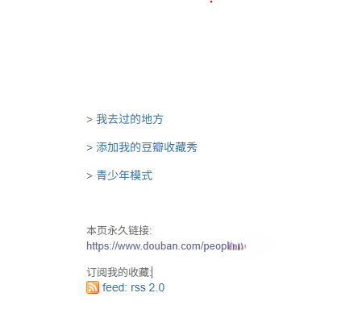

# Douban Track

[](https://github.com/lxulxu/douban-track/releases)

把豆瓣书影音记录自动同步到博客。基于豆瓣 RSS 订阅源，不需要配置 Cookie，设置一次 RSS 链接即可永久运行。

输出效果：

```markdown
---
title: "Y2026Q1 影视音总结"
date: 2026-01-01
categories: [生活]
tags: [生活]
---

## 🎬电影
- 2026-01-13. [**反人类暴行**](https://movie.douban.com/subject/37033221/) — ★★★★★

## 📚读书
- 2024-07-20. [**置身事内**](https://book.douban.com/subject/35546622/) — ★★★★☆

## 🎭戏剧
- 2025-10-10. [**摇滚红与黑**](https://www.douban.com/location/drama/26875868/) — ★★★★★

## 🎮游戏
- 2025-11-29. [**双点博物馆**](https://www.douban.com/game/37005305/) — ★★★★☆

## 🎵音乐
- 2026-07-01. [**Spiral**](https://music.douban.com/subject/35225780/) — ★★★★★
```

---

## 快速开始

### 获取 RSS 链接并设置 Secret

豆瓣个人主页 → 右下角「订阅」→ 复制 RSS 链接。



然后到博客仓库 Settings → Secrets and variables → Actions → Repository secrets，新建：

| Secret 名 | 值 |
|-----------|-----|
| `RSS_URL` | `https://www.douban.com/feed/people/你的ID/interests` |

### 添加 workflow

在博客仓库新建 action 文件，用法如下：

```yaml
name: Media Summary
on:
  schedule:
    # 每 24 小时运行一次
    - cron: '0 0 * * *'
  workflow_dispatch:

jobs:
  generate:
    runs-on: ubuntu-latest
    steps:
      - uses: actions/checkout@v4
      - uses: lxulxu/douban-track@v1
        with:
          rss_url: ${{ secrets.RSS_URL }}
          output_dir: content/posts          #改成①你的文章目录
      # 提交并推送生成的文件
      - run: |
          git config user.name github-actions
          git config user.email github-actions@github.com
          git add douban_data.json content/posts/*-media-summary.md || true  # ② 路径和①保持一致
          git diff --staged --quiet || git commit -m "Update media summary"
          git push
```

workflow 运行自动生成并提交 Markdown 文件到仓库，若博客仓库已配置自动构建部署（如 GitHub Pages、Vercel、Netlify 等），仓库更新后可自动渲染并发布。

> 运行后仓库会多出 `douban_data.json`（豆瓣历史数据缓存）和 `*-media-summary.md`（生成的总结）。

---

## Action 参数

| 参数 | 必填 | 默认值 | 说明 |
|------|------|--------|------|
| `rss_url` | **是** | — | 豆瓣 RSS 地址 |
| `period` | 否 | `quarterly` | `weekly` / `monthly` / `quarterly` |
| `output_dir` | 否 | `.` | Markdown 输出目录，相对于仓库根目录 |

- **`period`** — 输出周期，默认 `quarterly`（季度）。可选 `monthly`、`weekly`。不同取值的文件名格式：

| period | 输出文件示例 |
|--------|-----------|
| `quarterly`（默认） | `Y2026Q1-media-summary.md` |
| `monthly` | `Y2026M01-media-summary.md` |
| `weekly` | `Y2026W01-media-summary.md` |

```yaml
# 改为月报
- uses: lxulxu/douban-track@v1
  with:
    rss_url: ${{ secrets.RSS_URL }}
    period: monthly
```

- **`output_dir`** — Markdown 输出目录，相对于仓库根目录，默认 `.`。需与 workflow 中 `git add` 路径一致。

```yaml
# 指定输出到目录
- uses: lxulxu/douban-track@v1
  with:
    rss_url: ${{ secrets.RSS_URL }}
    output_dir: content/posts
```

---

## 自定义格式（可选）

如果想自定义输出格式，在仓库根目录放一个 `config.yml` 即可覆盖默认模板：

```yaml
file_template: |
  ---
  title: "{title}"
  date: {date}
  categories: [{categories}]
  tags: [{tags}]
  ---

  {sections}

section_template: |
  ## {icon}{label}

  {items}

item_template: "- {published}. [**{title}**]({url}) — {rating_stars}"

title: "Y{year}Q{quarter} 影视音总结"
date_format: "%Y-%m-%d"
categories: ["生活"]
tags: ["生活"]

sections:
  movie: { icon: "🎬", label: "电影" }
  book:  { icon: "📚", label: "读书" }
  music: { icon: "🎵", label: "音乐" }
  game:  { icon: "🎮", label: "游戏" }
  drama: { icon: "🎭", label: "戏剧" }
```

不同 `period` 应使用对应的 `title`，否则默认的 `Y{year}Q{quarter}` 在 monthly/weekly 下会产生不完整的标题。缺失的占位符会原样保留不报错。

占位符参考：

| 模板 | 可用占位符 |
|------|-----------|
| `file_template` | `{title}` `{date}` `{categories}` `{tags}` `{sections}` |
| `section_template` | `{icon}` `{label}` `{items}` |
| `item_template` | `{published}` `{title}` `{url}` `{rating}` `{rating_stars}` `{status}` `{type}` `{image_url}` |

以上所有模板均可使用公共占位符：`{year}` `{quarter}` `{month}` `{week}` `{period_type}` `{period_label}`

---

## 提示

RSS 每次只返回最近 10 条记录，数据从首次运行开始累积到 `douban_data.json`，无法回溯历史。cron 频率建议适配自己的更新速度，确保两次运行之间新增记录不超过 10 条即可。
